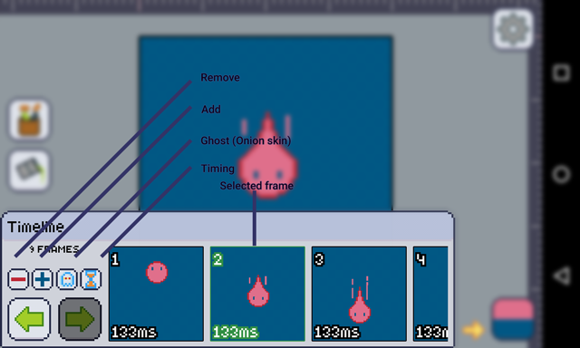

import GfyCat from '/src/components/GfyCat';

### Timeline

The timeline is on the bottom of the screen and usually collapsed, touch it to expand and you'll have the following window shown:

It consists of 4 buttons and a list of frames.

### The frames list

All the frames in your project will be shown here, the green one is the selected.
You can drag left or right to scroll through the list.
Touching a frame and holding your finger down for a second will allow you to **move this frame** somewhere else.
Swiping a frame up or down will completely delete it.

<GfyCat id="BelatedSoftKittiwake"/>

Don't shed tears if you delete or move something you didn't intend to. The [undo] button works fine for deletions and moves. Just hit it some times until it goes back to a place where you find yourself fine.

<GfyCat id="WastefulSardonicEgg"/>

### [Remove]

Remove the current selected frame.

### [Add]

Add a blank frame or duplicate the current frame.

### [Ghost]

Let you choose how many frames will be shown in the onion skin

### [Timing]

Set the duration of the current selected frame or all animation

[remove]: ./manage/delete.md
[add]: ./manage/create.md
[ghost]: ./onion.md
[timing]: ./manage/timing.md
[undo]: ../history.md