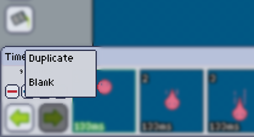

Hitting the **add** button will reveal a menu where you can choose if you want to insert a duplicate of the current selected frame, or a blank one.

Blank frames will have the first layer transparent if the [project is also transparent], otherwise, blank frames will have the first layer the same color as the current selected [secondary color].

Duplicates will duplicate all the layers of the current selected frame.

All new frames are inserted on the next position of the current selected frame.

[project is also transparent]: ../../mainmenu/colors-filters/transparency.md
[secondary color]: ../../color-brush/primary-secondary.md