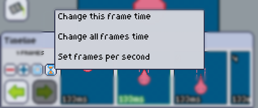

The hourglass button shows up a list of three options, each of them showing a different way of setting the duration of frames.

### Change this frame time

As you might have guessed, this changes the duration of the current selected frame. **Value in milliseconds**. e.g. Typing _1000_, will make this frame last _1 second_.

### Change all frames times

As opposed to the option above, this changes the duration of all frames of the animation. **Value in milliseconds**.  e.g. Typing _1500_, will make all frames last _1.5 second_.

### Set frames per second

This is a handy option that converts frames per second to duration. All frames will be affected. **Values in frames per second**.
e.g. Typing in 5, will **change all frames times** to 200ms:

$$
\frac{1 second}{5 frames} = 0.2 \frac{second}{frame}
$$

$$
0.2 \frac{second}{frame} \times \frac{1000 milliseconds}{1 second} = 200\frac{milliseconds}{frame}
$$