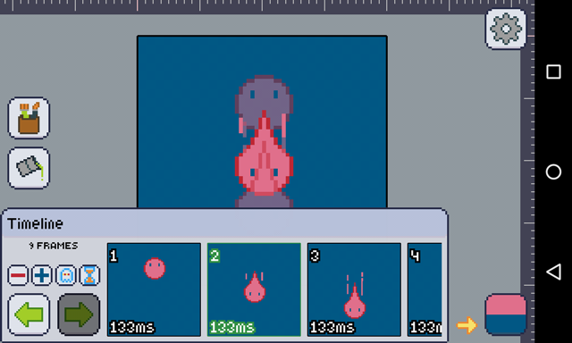

Currently, hitting the ghost icon will show a list of how many frames you want to show as onion skins. To disable it, just choose none.

:::caution
If you don't use a [transparent background][transparent], set up your [secondary color][pasc] to the background color of your art.

Otherwise, Pixly won't be able to tell what is art and what is background, thus, it won't be able to remove the background, making it impossible to render previous frames behind the current frame.

Well, just sort your [primary and secondary colors][pasc] and you'll be fine!
:::

[transparent]: ../mainmenu/colors-filters/transparency.md
[pasc]: ../color-brush/primary-secondary.md