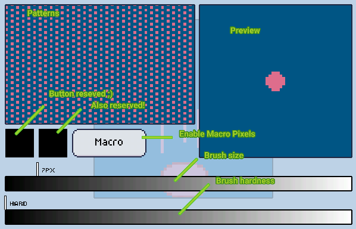

import GfyCat from '/src/components/GfyCat';

### [Patterns][pattern]
This is the preview of the currently selected [pattern], tap it to change it.

### Preview
This is how your brush is looking right now! The colors are the primary and secondary colors current selected.

### Reserved buttons
Expect some cool functionality there in the future!

### Brush size
Drag to change the brush size.
Remember that trick of the basics page? no?

> **The ultmost shortcut** here, is that you can change the brush size without going into the brush settings. You just gotta touch the screen with **THREE** fingers (like making a circle with your thumb, index and middle fingers) and expanding or contracting them.
> <GfyCat id="BlackandwhiteTartGalapagosdove" />

### Brush hardness
When you have a large brush, makes the brush softer or harder. It pretty much controls the opacity throughout the brush.

### Macro pixels
This is a cool function that [SolarLune suggested to me in /r/gamedev][reddit], and it worked pretty awesomely to be honest. It will snap your brush to a grid that is the size of your brush. Well, Try it and you'll know what I'm talking about :P. *This feature is experimental and may change in the future*

[pattern]: ./patterns.md
[reddit]: https://www.reddit.com/r/gamedev/comments/25ieti/ive_been_making_a_pixel_art_editor_and_am/chhuyaw.md