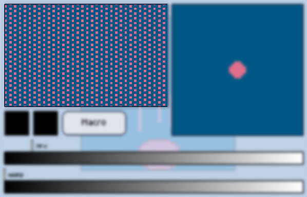

import GfyCat from '/src/components/GfyCat';

Pixly comes bundled with 15 different patterns, and although you currently cannot load your own patterns to pixly, you'll soon be able to do so. (Near future!!)

The current selected pattern affect how some tools act, so remember to try out different patterns when using some patterned tools.

You can change the current selected pattern on the [brush screen][brush], some tool settings even send you there as a shortcut.

<GfyCat id="MediumDisguisedJaeger"/>
<GfyCat id="ApprehensiveFearfulGazelle"/>

[brush]: ./index.md