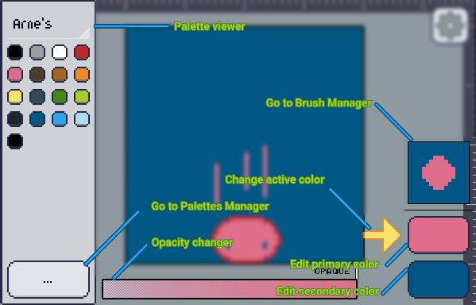

Pixly can have a unlimited amount of palettes loaded by you. [You can load your own .act, .aco, .ase, .jasc, .pal and .png files][custom], and these palettes may have a maximum of 4096 colors each.

Apart from the palettes you load, [some palettes are bundled][systempals] into pixly for your convenience, between these are the **NES**, **Master System**, **GameBoy** and **C-64**. These called [System Palettes][systempals] can't be deleted.

### The recents palette
One of these system palettes is very important, it's called **Recents**. It will be updated constantly as you use the [color selector]. So whenever you want to find a color you picked in the past, it should be there.

:::note
If you pick a color twice in the selector, it will only be added once to the recents palette.
:::

:::tip
If you want more control over a palette than the recents give you, try creating a [custom palette][custom].
:::

### Palette viewer
Whenever you expand the [Colors and Brush][candb], you'll get to see the palette viewer by the left of your screen.

At the top of it, there's the name of the current selected palette, tapping it will open a menu where you can select another palette.

Below the palette name, you'll see a list of colors. These are the colors of the selected palette. As a palette may have up to 4096 colors, you may scroll up and down to see the rest of the colors.

Try tapping one of these colors, and the [color selected by the yellow arrow][pasc] will change into that color.

The button at the bottom of the palette viewer, it leads you to the [Palette Manager], where you can load, export, delete, organize... do stuff with your palettes.

[candb]: ../index.md
[custom]: ./custom.md
[systempals]: ./system.mdx
[pasc]: ../primary-secondary.md
[color selector]: ../selector/index.md
[palette manager]: ./manager/index.md