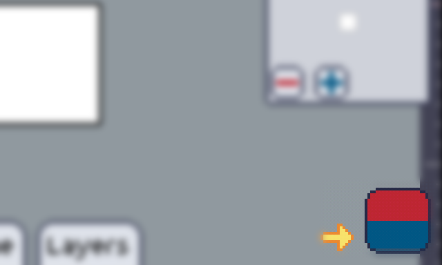

In Pixly, we have two colors, the **primary** and the **secondary**. Often called by the names of **foreground** and **background** colors too.

The primary color is the one on the top, and the secondary is the color on the bottom.

_**Some**_ tools allow you to swap the colors, in that case, the color which the yellow arrow is pointing to will act as the primary, and the other as the secondary. To swap them, just touch the yellow arrow.

The concept is quite simple, most of the time, the **secondary** color should be set to be the same as the **background** color of your artboard, and the **primary** color should be set to be whatever you want, whatever color you'll be using to paint.

Many features will rely on the secondary color to be properly set to the background color. Examples are the [onion skinning] and the [eraser tool].

So what's the matter? Why a whole page just to describe this? It turns out that (to keep the UI simple), the secondary color will at times have another purpose, and you might have to change it back and forth.

:::note
 E.g.: The [gradient tool] will make a gradient that ranges from the primary color to the secondary color. You'll probably want to change the secondary color to some color that is not the background color.

_The catch here is:_ You **MUST** remember to [switch] the secondary color back to the color of your background. Saving the background color in a [palette] might help.
:::

"**MUST**" is kinda subjective here. Unless you're using filters, or need to see the onion skins properly, or are using the eraser, then probably you're fine if you delay switching it. But as soon as you need one of these, you gotta change the secondary color to the background color.

With that said, if your background is [transparent], the secondary color is mostly irrelevant and you can use it in whatever way you wish!

[onion skin]: ../animation/onion.md
[eraser tool]: ../toolbar/tools/eraser.md
[gradient tool]: ../toolbar/tools/gradient.md
[transparent]: ../mainmenu/colors-filters/transparency.md
[switch]: ../toolbar/tools/picker.md
[palette]: ./palettes/index.md