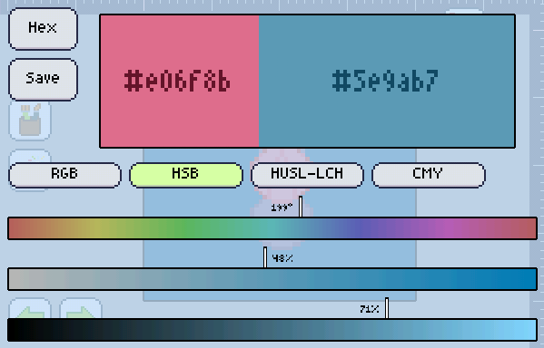

import GfyCat from '/src/components/GfyCat';

Whenever you tap the primary or secondary color with the [Color and Brush] expanded, you'll end up here, where you can edit that color to whatever you wish.

Editing colors is so easy!

To begin, just drag the 3 handlers on the bottom of the screen and get the color to look as you wish.

Are you **done**? Tap the square with the color you just made _(the big one on the top-right)_, and you're all set.

Do you think you made a mistake? Tap the square with the color it was before you started editing _(the big one on the top-left)_, and it will **revert all changes**.

Want to save the color to a palette, or even create a new palette from that color? Hit **Save**!

Have a notepad full of hex codes and want to type a color in? Hit **Hex**, type it in then press OK.

Want to try a different way of editing the color? Try changing the **[Color system]**, by tapping RGB, HSB... Drag the buttons to the left to reveal other [color systems].

<GfyCat id="DescriptiveAmpleFieldmouse"/>

[color and brush]: ../index.md
[color system]: ./systems.md
[color systems]: ./systems.md