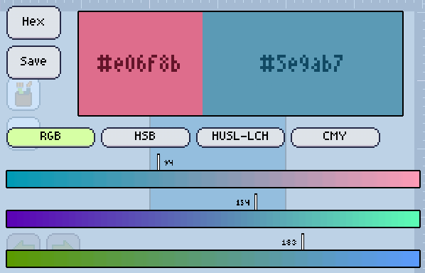
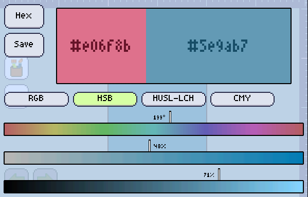
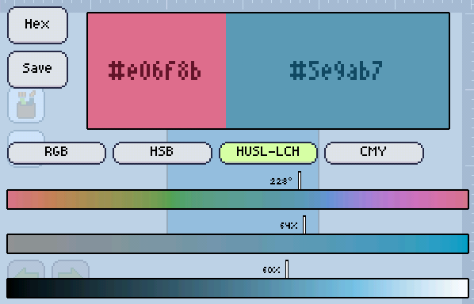
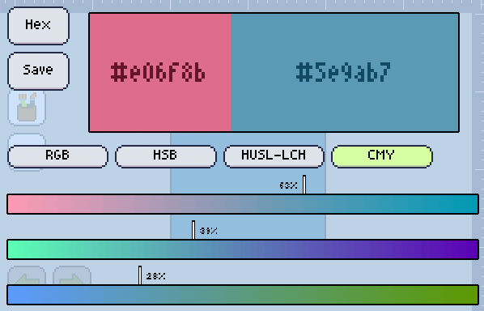

Pixly allow you to try out different color systems, so you can hunt that perfect color differently.

Here's a summary of what color system we currently have

### RGB
This system is the one used by computer screens, you can change the amount of Red, Green and Blue of the color.

### HSB
Very common system and what most people is used to. Present on MS Paint, Photoshop and GIMP, you can change the Hue, Saturation and Brightness of the color.

### HUSL-LCH
A normalized version of the LCH (Cylindrical CIELUV) system, but also called HuSL (Human-friendly HSL), made by [Alexei Boronine][huslmaker], is a system that takes into consideration **apparent** brightness and saturation, instead of simply changing it mathematically. Good when you want to change the hue of a color without changing its apparent brightness!

### CMY
The system the printers use, and some people are taught on school.

[huslmaker]: https://www.hsluv.org/.md