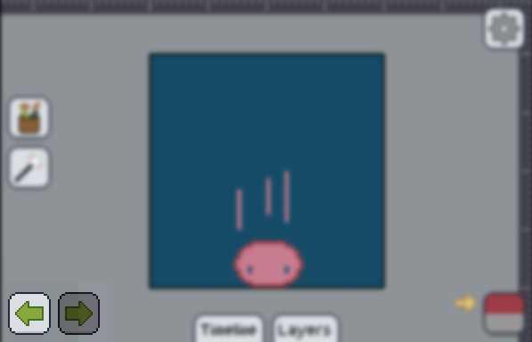

Pixly has a history system, upon which most operations are recorded and you can **undo** and **redo** them.

The undo and redo buttons, represented by green arrows are located in the bottom-left corner

The arrow pointing left is the Undo, likewise, the one pointing right is the Redo.

A lit button represents that there's operations to be undone or redone, a unlit button shows that there's no operation to be undone or redone.

In landscape you can see a History tab at the bottom. When expanding it, you can check all the operations you executed, and choose one to go back to.