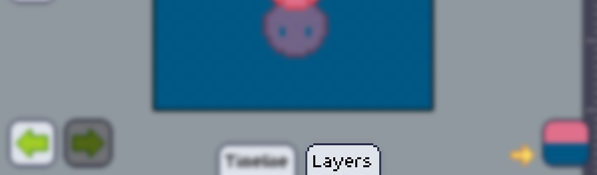
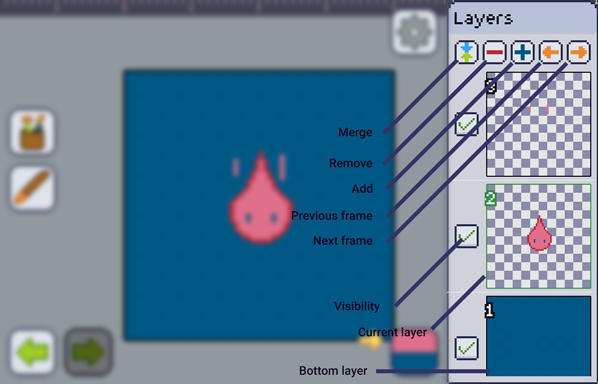

import GfyCat from '/src/components/GfyCat';

### Layer Window

The layer window is on the right of the screen and usually collapsed on the bottom.

:::note
The layer window isn't shown on portrait mode. Make sure the phone rotation isn't locked and turn your phone into landscape to see it.
:::

Touch it to expand and you'll have the layer window shown:

It consists of 5 buttons and a list of layers, all described below.

### Things to keep in mind...
All [frames] have the same amount of layers, **always**. But unlike Photoshop, in Pixly, each frame has his own set of layers. Frames share only the amount of layers, they don't share the images in them, or the visibility settings of the layers.

Layers are able to [move] freely. When one layer move, the other layers in other frames aren't touched, they remain the same.

The bottom layer is never able to move, so think before drawing directly to it. You're still able to copy/paste/clear stuff off of it.
If your [project is transparent] your bottom layer will be able to have transparency, otherwise it will always be a solid color, the [secondary color]. The other layers will always be able to have transparency, independent of your transparency settings.

### The layers list

All the layers of the current frame will be shown here, the green one is the selected layer. You can drag up or down to scroll through the list. Touching a layer and holding your finger down for a second will allow you to **move this layer** somewhere else.
Swiping a layer left or right will delete it.

<GfyCat id="FarawayFaithfulAmericanbobtail"/>

If you delete or move something you didn't intend to. The [undo] button works fine for deletions and moves.

<GfyCat id="ThreadbareUnevenHapuku"/>

### [Merge]

Merge the current layer with the one right below it.

### [Remove]

Remove the current selected layer

### [Add]

Add a blank layer or duplicate the current layer.

### Previous Frame

A shortcut to change to the previous frame without having to open the [animation timeline]

### Next frame

A shortcut to change to the next frame without having to open the [animation timeline]

### [Visibility]

Toggles the visibility of that layer. A hidden layer is also hidden when exporting.

[project is transparent]: ../mainmenu/colors-filters/transparency.md
[secondary color]: ../color-brush/primary-secondary.md
[move]: ../layers/manage/move.md
[frames]: ../animation/index.md
[animation timeline]: ../animation/index.md
[undo]: ../history.md

[merge]: ../layers/manage/merge.md
[remove]: ../layers/manage/delete.md
[add]: ../layers/manage/create.md
[visibility]: ../layers/manage/visibility.md