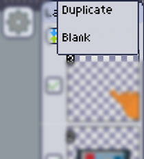

Since all frames always have the same amount of layers, creating a layer on a frame will create one on all other frames too.

Hitting the **add** button will reveal a menu where you can choose if you want to insert a duplicate of the current selected layer, or a blank one.

Since you cannot create the [bottom layer], all new layers are all [transparent].

Duplicates will duplicate the current selected layer of each frame.

All new frames are inserted on the next position of the current selected frame.

[bottom layer]: ../index.md#things-to-keep-in-mind
[transparent]: ../../mainmenu/colors-filters/transparency.md