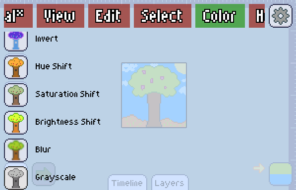

Under the **Colors** tab of the main menu, can be found 6 filters (can change in the future), these are operations that help you change all the colors of the artboard easily.

In case you have an [area selected][selection], the filter will be applied to that area only.

### Invert

Will invert all the colors of the image. The formula is $$RGBA' = (1-R,\,1-G,\,1-B,\,A)$$

### Hue Shift, Saturation Shift and Brightness shift.

The name says it all. You can choose if you want to shift that parameter on HSB or HUSL. Doing it on HUSL is useful to keep the perceptive contrast of the colors.

### Blur

Blurs the image, in with a gaussian or box filter.

:::danger
Due to a known bug, it may currently crash on old/slow devices.
:::

### Grayscale

It is different than saturation shift, because it allows you to quickly find a good grayscale ramp to apply.

[selection]: ../../selection/index.md