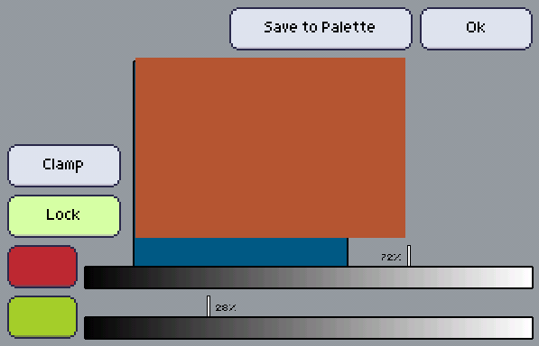

Allow you to generate colors in between two picked colors.

+ Lock

   If locked, you won't be able to add values out of the range, the sum of each color contribution will always be 100%.

+ Clamp vs Normalize

   If the sum goes out of the range, clamp will simply set that parameter to 100%. By normalizing, a [vector normalization](https://en.wikipedia.org/wiki/Unit_vector) will be applied on the value.

The two sliders represent how much each color contributes to the resulting colors, they're then simply mixed with RGB interpolation.

