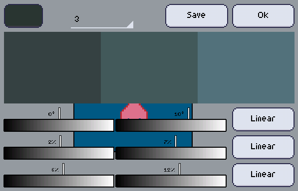

Generate Color Ramp is an experimental feature that... generates color ramps! It is quite unpolished for now, but it's pretty much functional. A more polished and with more options version is on its way.

+ Base color
   
   This is the color which you ramp will start.

+ Amount

   How many colors will be generated?

+ Save

   You can create a new palette with the generated ramp plus the base color, or create a brand new palette with all the colors.

+ Ok

   Close the ramp generator.

+ Increase start

   By how much will that value start increasing by each step.

+ Increase start

   By how much will that value end increasing by each step.

+ Interpolation algorithm

   Change the algorithm used to interpolate the increase start/end of that value.

### How does it work?

There are 3 rows of sliders(handlers), the first row is for **hue**, the second for **saturation** and the third is for **brightness**.
Each row has 2 sliders, one is for the **increase start** and the second for **increase end**.
<table>
	<tr>
		<td>Hue Increase Start</td><td>Hue Increase End</td>
	</tr>
	<tr>
		<td>Saturation Increase Start</td><td>Saturation Increase End</td>
	</tr>
	<tr>
		<td>Brigtness Increase Start</td><td>Brightness Increase End</td>
	</tr>
</table>
   

Let's suppose our amount is 3 colors, and our _base color_ is `(180°, 20%, 20%)`.
By using an _increase start_ of `(0°, 2%, 6%)` and a _increase end_ of `(10°, 6%, 12%)` and a `Linear` _interpolation_ for all values, these will be our results:

The color number 1, which is the first color of the ramp will have an increase from the previous (base) color equal to the increase start, so that's: `(180°, 20%, 20%) + (0°, 2%, 6%) = (180°, 22%, 26%)`.

The color number 2, which is right in the middle of the ramp, will have an increase from the previous (color 1) color equal to halfway between increase start and increase end (using the interpolation algorithm choosen), ie: `(180°, 22%, 26%) + (5°, 4%, 9%) = (185°, 26%, 35%)`.

The color number 3, which is the last color, will have an increase from the previous (color 2) color equal to the increase end, here's it: `(185°, 26%, 35%) + (10°, 6%, 12%) = (195°, 32%, 47%)`.

Instead of numbers, here's the result in colors: 

