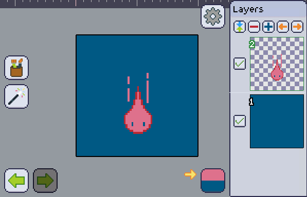
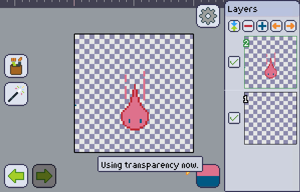

Your project may be transparent or not transparent. A **transparent project** is able to have its [bottom layer][layer] background transparent, when non transparent ones can't.

Other [layers][layer] that are not the bottom one will always be able to have their background transparent.

Whenever you enable transparency, all the pixels on bottom layers that are the same as the [secondary color] will be treated as background, turning them all transparent.

Likewise, disabling transparency will turn all the transparent pixels on bottom layers into the [secondary color].

| Transparency disabled |  |
| --------------------- | ---------------------------------- |
| Transparency enabled  |   |

[layer]: ../../layers/index.md
[secondary color]: ../../color-brush/primary-secondary.md
