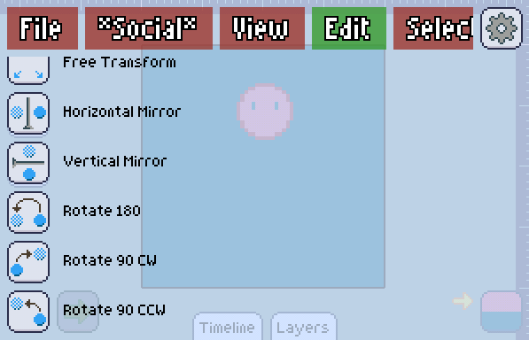

Basic transforms are a set of transforms that you can quickly do on your image instead of going to [Free Transform] and doing it by hand.

Here are the set of basic transforms that Pixly supports:

+ Horizontal Mirror
+ Vertical Mirror
+ Rotate 180
+ Rotate 90 Clockwise
+ Rotate 90 Counter Clockwise

One of the advantages of doing basic transforms over [free transform], is that you will be asked how you want to apply that transform: *Globally*, *On this layer only*, or *On the [selected] area*. Doing transforms globally will apply them to all layers and frames.

In case of a layer only or a selected area transform can't fit the transformed image back to where it was, you'll have the option to reposition it, so you can fit it yourself. In this case, the [secondary color] becomes important as it is used to distinguish the image from its background.

[selected]: ../../selection/index.md
[free transform]: ./free-transform.md
[secondary color]: ../../color-brush/primary-secondary.md