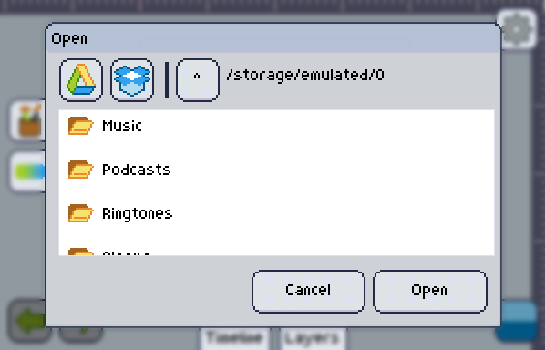

On Pixly, you have two options when loading images in. You may **Open** images or **Import** them.

### Open
When opening an image, all your current artboard will be **deleted** and everything will be **replaced** with this new image (or animation) you loaded.

If you want to load a previously saved project that has more than one layer and/or more than one frame, start opening the `.anim` or `.pixly` file, otherwise, you'll end up opening just its sprite sheet.

### Import Frame
When importing an image, all your current artboard will be **kept**, and this image you loaded will be added **alongside** as a new [frame].

:::note
As all frames ALWAYS have the same [layer] count, blank layers will be added in case it doesn't match the layer count of your project.
:::

[frame]: ../../animation/index.md
[layer]: ../../layers/index.md