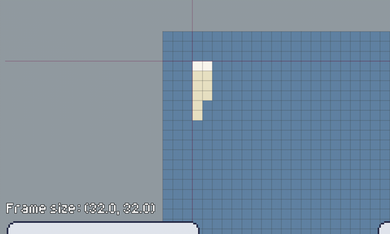
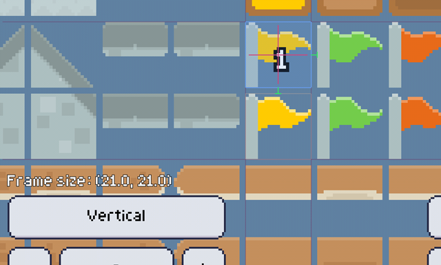
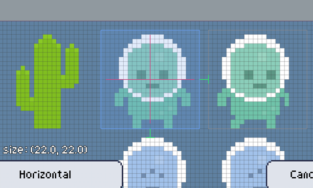
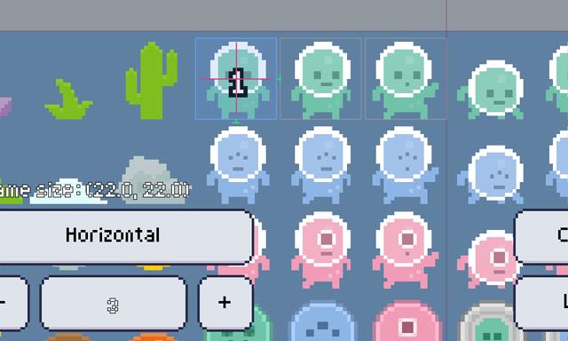
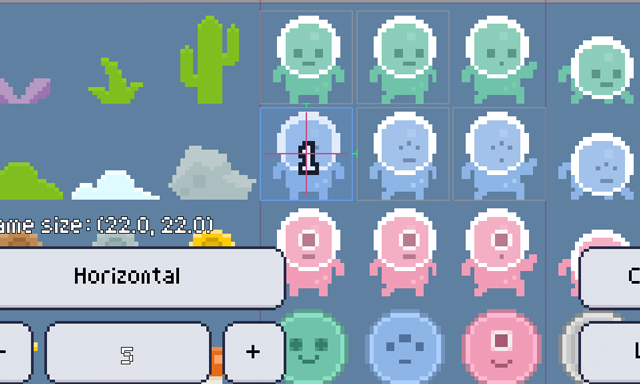
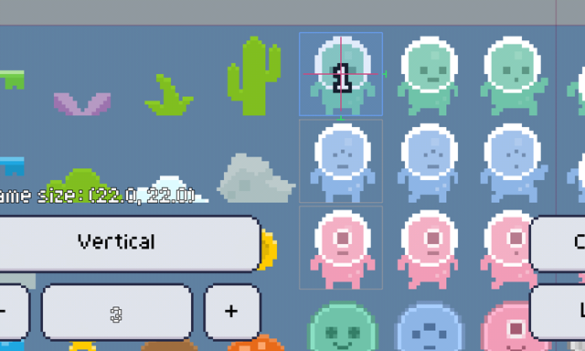
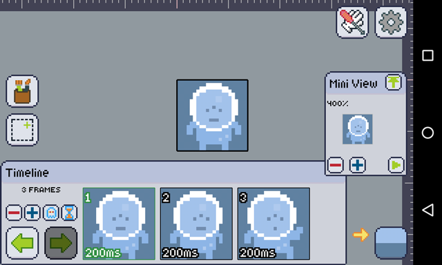

Splicing spritesheets is a really boring and long task, that's why Pixly has a built-in spritesheet loader for you!

There are lots of different ways which a spritesheet may be laid out, and Pixly try to cover all of them. For that reason, the initial configuration of the loader is to load what most spritesheets looks like, but you can customize it *a lot*.

Here's a step by step on how to setup the sprite sheet loader:

### 1. Setup the start offsets to where the spritesheet starts.

The four purpleish lines that cross the image are the **start and end offsets**. You should set them properly to where the spritesheet begins, and where it ends. Do that by dragging them. This way we can account for any gaps and offsets at the start and end of the image.

You can even use it to load a sub sheet inside a bigger sheet:

This way, you set the offsets to the area of the smaller animation, and only load it, even though the sheet may contain lots of other unrelated animations.

### 2. Setup the area of the first frame to be right on top of the first frame.

You should set the blue rectangle to cover exactly where the first frame is. The pink lines are there to help you identify the center of the rectangle.

To do that, you may drag the center of the rectangle to move it, and drag its borders to expand it. If you're having trouble, try zooming in and trying again.

### 3. Setup the direction, way and gap

Each frame is a new section on a sheet, that section may be to the left or right side of the current frame, or they can be placed to the top or bottom of the current frame.

First select either **Horizontal** or **Vertical** on the direction button to pick the direction which the sheet flows.

Then, check the green handle on the borders of the first frame section, you'll see two of them. One is for the horizontal gap between frames, and another for the vertical gap between frames.
You may drag these handles over to the other side, in case they're not on the way you wish yet. And after they are on the way the sheet flows, drag them until they're touching the section where the second frame starts.

It sounds hard, but is actually very simple! Just remember the green handles are the gap between the frames, and they should be pointing to where the next frame should be.

:::tip
Zoom in if you're having trouble precisely setting the gap between frames
:::

Here's what different gaps and directions look like:

#### Horizontal, right and bottom
This setup will pick frames in a **line**, starting from the **left** going to the **right**. The following frame line is the one **below** the current line.

#### Horizontal, right and top:
This setup will pick frames in a **line**, starting from the **left** going to the **right**. The following frame line is the one **above** the current line.

#### Vertical, right and bottom:
This setup will pick frames in a **row**, starting from the **top** going to the **bottom**. The following frame row is the one **to the right of** the current row.

### 4. Choose the amount of frames the sheet has.

Touch the minus and plus buttons to add and remove frames, or tap the number itself to type in a number! If the loader can't fit any more frames in the given area, it will limit the number.

### 5. Hit Load!

And enjoy you loaded animation!

-------------

### Bonus Tips

+ Try increasing the frame amount before finishing, and pay attention to the light-gray rects that will appear, they show where the next frames are going to be.
+ You don't have to always bother with the start and end offsets, just when your animation takes more than one row or column.
+ Have I already said how zooming in makes everything easier?