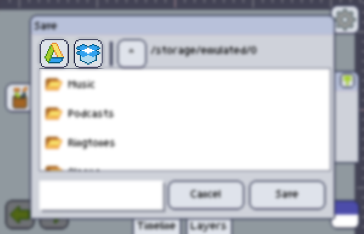

Aside from [sharing your art][share], you have different ways of saving your work, and each of them might be better, depending on your purpose.

You may divide them in two different categories:

### Export

Exporting an image will generate a single file for the current state of your art, so you can use it somewhere else.

#### Export GIF animation

Gets all the [frames][animation] of your project, joins their [layers][layer] (excluding the invisible layers) and makes a GIF from them.

#### Export frame

Joins the [layers][layer] (excluding the invisible layers) of the current frame, and make a PNG from it

#### Export all frames

The same as the *Export frame*, but will do it for ALL frames. The frames will all be saved with a postfix of their index. i.e. If you export the frames of an animation and name it as `myAnimation.png`, the generated files will be named `1 - myAnimation.png`, `2 - myAnimation.png`, `3 - myAnimation.png`...

#### Export as sprite sheet

Will export all frames, but put them on a single PNG, in the form of an sprite sheet/atlas.

------------

### Save as

Will let you choose where and by which name you want to save your project. If it has already been saved before, only the newest file will be updated by *Save*

### Save

If your project is new (it hasn't been saved before, and it was not loaded from the disk), then you'll be asked to *Save as*, otherwise, all changes to the content of your project will be updated to the last file handle that you saved.

------------

### File structure

Pixly projects are very simple files. If your project consist of only one frame and one layer, then it will be saved as a plain PNG.

If your project has more than one frame or more than one layer, then it will be saved as a sprite sheet of all layers of each frame, and a companion file with the same name as the sheet but with the extension `.anim`.

### .anim files

`.anim` files are XML files that have information about the spritesheet that go along with them. This info allows pixly to know how many frames and layers, and where each layer of a project is on the sheet.

If you're interested in the technical details, here's the format of the file

```xml
<PixlyAnimation version="1.5"> <!-- Current (and described in this file) version is 1.5 -->
	<Info sheetWidth="320" sheetHeight="256" totalCollumns="5" totalRows="4" frameWidth="64" frameHeight="64" layerCount="2"/>
	<!-- info of the sheet itself, how many columns and rows it has, and what size is each frame/layer. Also, the amount of layers the project has -->
	<!-- Keep in mind the attribute is named `totalCollumns` instead of `totalColumns`. It was a typo that ended up never being fixed. -->
	<Frames length="20"> <!-- how many frames/layers are expected to be inside this tag -->
		<Frame duration="150" visible="true"> <!-- frame time in millisseconds and if it is visible -->
			<Region x="0" y="0" width="64" height="64"/>
			<Index linear="0" collumn="0" row="0"/>
		</Frame>
		<Frame duration="150" visible="true">
			<Region x="64" y="0" width="64" height="64"/>
			<Index linear="1" collumn="1" row="0"/>
		</Frame>
		<!-- All other frames goes here -->
		<!-- Layer are mentioned as frames too. -->
	</frames>
</PixlyAnimation>
```

### Dropbox and Google drive integration



Pixly used to have Dropbox and Google Drive integrations, but these have been deprecated and will soon be replaced with native Android integrations.

[share]: share.md
[animation]: ../../animation/index.md
[layer]: ../../layers/index.md
[load]: open-import.md