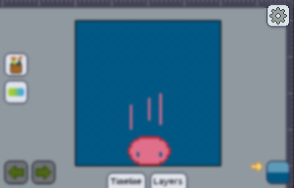
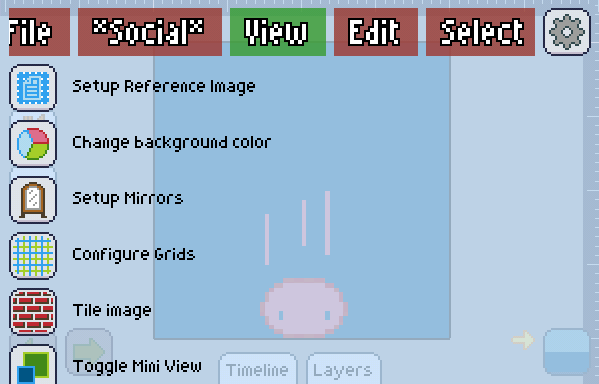

The Main Menu will be your hub to all actions that do not involve painting directly into the artboard.

Want to [save or export][save] your work? [Load another image][load] in? [Setup the grids][grid]? It covers you.

You can find the main menu on the top right of your screen, or by the side of the [layers window], in case it is open.

On the main menu you'll find tabs on the top, which you can scroll left and right.

You can also swipe by the edges of the screen to change between the tabs.

Try explorating the Table of Contents by the right of this text to find out what's in each menu.

[layers window]: ../layers/index.md
[save]: ../mainmenu/file/save-export.md
[load]: ../mainmenu/file/open-import.md
[grid]: ../mainmenu/view/grids.md