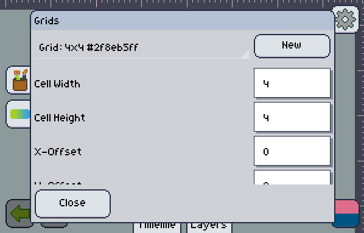
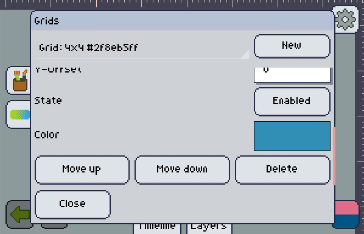

import GfyCat from '/src/components/GfyCat';

Pixly allows you to set up as many different grids you want on your artboard. Here's what you need to know to customize a grid:

+ Cell Width & Height

   These are the size of each cell of your grid.

+ X-Offset, Y-Offset

   How much will the grid be offset from the top-left corner.

+ State

   A disabled grid won't be shown.

+ Color

   Change the color of each grid.

+ Move up, Move down

   This will push the grid up or down in the priority list, the list at the top of the grids window. The ones on the bottom will be shown behind the ones on top.

+ Delete

   Remove the grid completely.

:::note
If you have lots of grids, they will only be shown if they're big enough to show something substantial on the screen.

<GfyCat id="CloudyCircularDugong"/>
:::