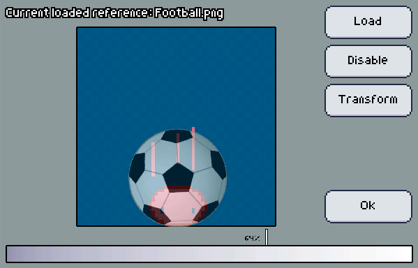
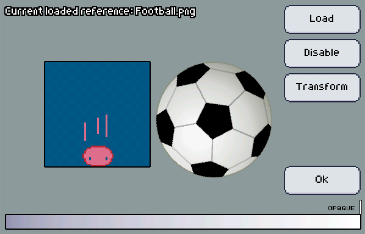

Setting up reference images is easy, just load an image and you're good to go. The image will fit on your artboard canvas and set to a reasonable opacity.

However, you can change some parameters as you desire:

+ To change the opacity of the reference, drag the slider on the bottom of the screen.
+ Use the transform button to enter in a mode where you can drag the reference photo around to move it, use two fingers to rotate/scale it.
+ You can disable the reference temporarily by tapping the disable button.

:::tip
You can try to set the reference photo to its maximum opacity, but instead of placing it on top of the artboard, you may place it by the artboard! The reference will still follow your artboard just as a reference on top of it would.

:::