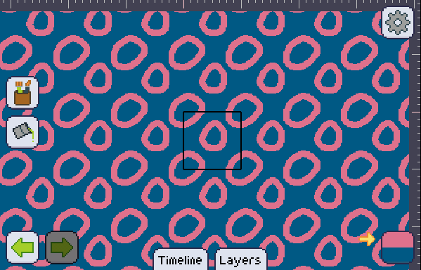

import VideoEmbed from '/src/components/VideoEmbed';

Making images that tile on pixly is super fun! You just need to toggle it on the menu and everything just works.

The best part of it is that the tiles act as they were the artboard themselves, so you can draw seamlessly!

<VideoEmbed id="DistortedAdmiredEyra"/>
