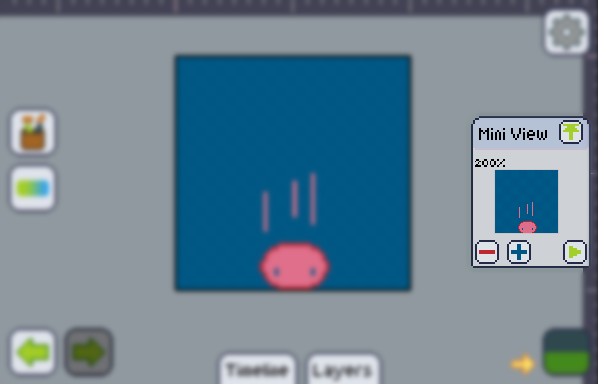

### The mini view window

The mini view window which usually starts at the right of the screen is a utility that helps you preview the state of your work in scale, with no grids, and even animated in the case of animations.

### Zoomable

The mini view has a range of zoom ratio of 12% up to 3200%. So you can zoom out big artboards and zoom in for small ones. You can change the zoom by tapping the **plus** and **minus** buttons on the mini view window.

### Playable

You can hit the play button on the bottom of the mini view to start playing the animation you made. The frames will be played at [the speed you set them] on the Animation window.

### [Big preview]

By tapping the arrow pointing upwards at the top of the mini view, you'll be sent to the [big preview] screen.

[the speed you set them]: ../animation/manage/timing.md
[big preview]: ./bigpreview.md