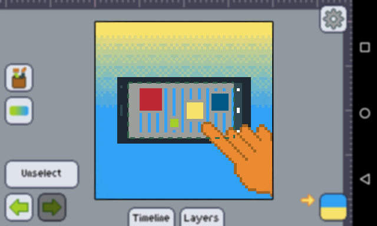

Pixly _does_ support selection, as many other art and photo editors. Most features work just as you might have learned from other editors like Photoshop and GIMP, except that what you're used to do on the keyboard will be done on the touch screen. You can try using the [marquee tools], to select and deselect areas.

The key differences here are:

+ Since we may be talking about 4.7"+ devices, and not 17" monitors, you'll notice that the _"marching ants"_ in Pixly are actually quite bold and have a greenish tone instead of being thin and black and white. This is to help you notice better what's going on in a tiny screen.
+ Having a finger on the way may be cumbersome to some tools like the magic wand, but _fear not, my friend_! The marquee tools have a nice preview state shown before you lift your finger. That means you can drag your finger around in tools like the [magic wand] to choose which area you want to add to the selection.
+ If you want to [deselect][deselecting] everything, try hitting the "unselect" button that automagically appears in the screen as soon as you get something selected. Check more in the section [Deselecting].
+ Similarly, not having a keyboard means no shortcut for inverting the selection. Check out [Invert] to know how to do it.

Here's what is similar and you probably wanted to know to be sure:
+ When you have area selected, most of the tools will consider that as a boundary. For example, if you have something selected and you decide to use the [brush tool], only the selected area will be painted.
+ Effects also consider the selection as boundaries. E.g.: When using the [hue shift] effect, only the selected area get shifted.
+ All edit operations, such [Free transform], [basic transforms], [copy & paste][copy-paste] and [clear] will be applied on the selection as well.

[deselecting]: ./deselecting.md
[invert]: ./invert.md
[brush tool]: ../toolbar/tools/brush.md
[hue shift]: ../mainmenu/colors-filters/filters.md#hue-shift
[free transform]: ../mainmenu/edit/free-transform.md
[basic transforms]: ../mainmenu/edit/basic-transforms.md
[copy-paste]: ../mainmenu/edit/copy-paste.md
[clear]: ../mainmenu/edit/clear.md
[marquee tools]: ../toolbar/tools/marquee/index.md
[magic wand]: ../toolbar/tools/marquee/wand.md