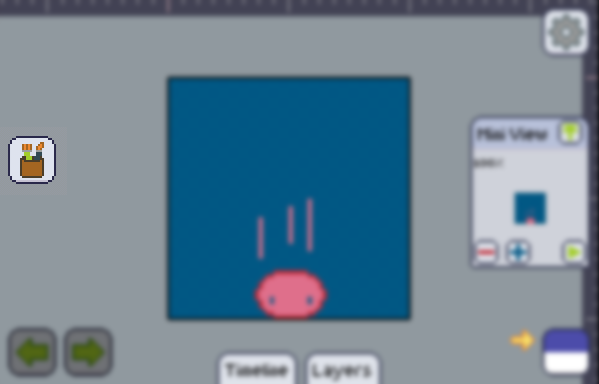
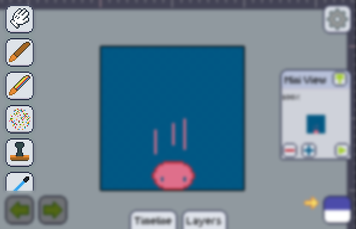
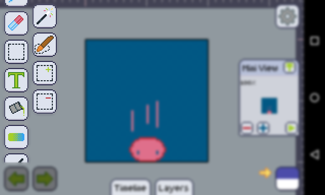

import GfyCat from '/src/components/GfyCat';

The toolbar is where you'll find most of the tools you can use to draw transform your pixel art.

The toolbar is represented by *a cup with brushes* and can be found at the left of the screen.

Hit it to reveal all the tools under your disposal:

There's currently about 21 tools in Pixly, if not all of them fit on your screen (which is likely to happen), you can scroll the list up and down too see what's offscreen.

<GfyCat id="HotGlisteningAzurevase"/>

Not all of the tools are in the main toolbar one example of such is the [Marquee (selection) tools][marquee], you can tap a parent tool to find out a second smaller toolbar by the side of the bigger one.

### "Cool, I wanna know more!"

Feel free to look into the [Quick Access] tool, and check out how the [Tools] work, and what each of them do.

[marquee]: ./tools/marquee/index.md
[quick access]: ./quickaccess.md
[tools]: ./tools/index.md