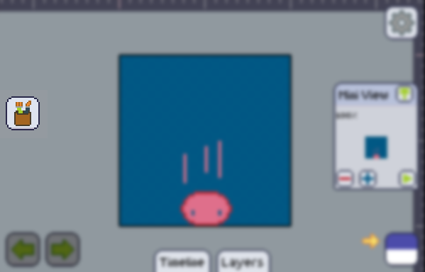

import GfyCat from '/src/components/GfyCat';

If you find yourself switching constantly between two tools whenever you're drawing, then this feature was made just for you.

-----

Whenever you open pixly you'll find your toolbar button alone.

But if you select a tool, that tool will be kept in memory, and when you pick another tool, that tool will start to show up right below the toolbar button:

<GfyCat id="DapperWellgroomedKookaburra"/>

:::tip
If you're not working out how to change the two tools in the quick access, try re-selecting one at a time the tools you want to get there.
:::
