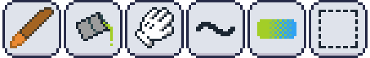
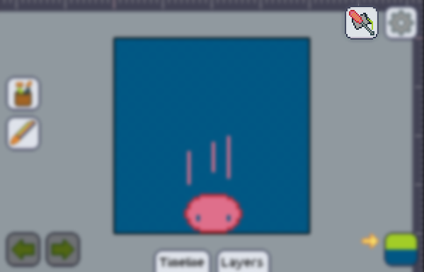
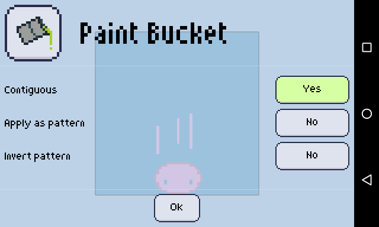

In Pixly, everything that can be accessed through the toolbar is considered to be a tool, and we currently have about 21 of these.

### Settings

Some tools can be customized or changed in the way they operate, if you find a tool like this (examples are the [Bucket fill] and [Line] tools, but there's more!), you can access its settings by tapping the icon which appears, **tool and a _screw driver_**:

If you touch it, the settings for the selected tool expand.

Here's how it looks like for the [Bucket fill]:.md

### The tools

If you want to know more about the tools, it's recommended to read the subpages of this guide. You can find them at the sidebar, under the purple "Toolbar" line.

:::tip
Keep in mind that most of the tools are affected by [color and brush] settings! Don't forget to check out that section of the guide!
:::

[bucket fill]: ./bucket.md
[line]: ./line.md
[color and brush]: ../../color-brush/index.md